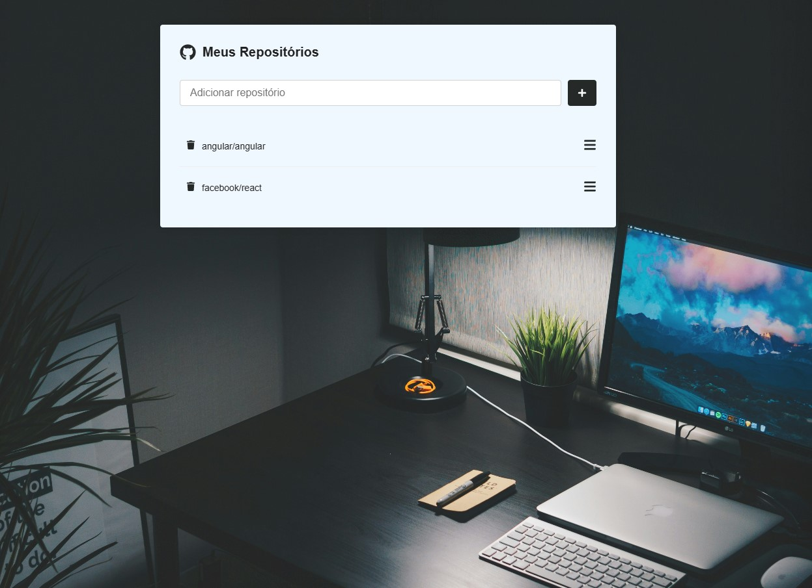

# 🧭 GitHub Finder

Aplicação web desenvolvida com ReactJS que permite buscar repositórios públicos do GitHub, visualizar detalhes e armazenar localmente os favoritos. Ideal para quem quer acompanhar seus projetos preferidos de forma simples e organizada.

## 🚀 Tecnologias utilizadas

- ReactJS
- Axios
- React Icons
- React Router DOM
- Styled-Components

## ✨ Funcionalidades

- ✅ Buscar repositórios públicos do GitHub
- ✅ Exibir lista dos repositórios buscados
- ✅ Evitar repositórios duplicados
- ✅ Salvar a lista no `localStorage` do navegador
- ✅ Deletar repositórios da lista
- ✅ Acessar detalhes do repositório com redirecionamento para o GitHub

## 🖼️ Interface

 <!-- Você pode gerar uma imagem do app e salvar como preview.png na raiz -->

## 📦 Instalação

1. Clone o repositório:

```bash
git clone https://github.com/seu-usuario/github-finder.git
cd github-finder
npm install
npm start
```

## 📂 Estrutura de pastas

src/
├── pages/
│   ├── Main/
│   └── Repositorio/
├── services/
│   └── api.js
├── styles/
│   └── GlobalStyle.js
└── App.js

## 🤓 Autor
Desenvolvido por Michel com 💙 usando React


# 🧭 GitHub Finder

A web application built with ReactJS that allows users to search for public GitHub repositories, view details, and locally store favorites. Ideal for keeping track of your favorite projects in a simple and organized way.

## 🚀 Technologies Used

- ReactJS
- Axios
- React Icons
- React Router DOM
- Styled-Components

## ✨ Features

- ✅ Search public GitHub repositories
- ✅ Display a list of fetched repositories
- ✅ Prevent duplicate repositories
- ✅ Save the list in the browser's `localStorage`
- ✅ Remove repositories from the list
- ✅ View repository details with redirection to GitHub
- ✅ Responsive interface with visual feedback (loading spinner and validations)

## 🖼️ Interface

 <!-- You can generate an app screenshot and save it as preview.png in the root -->

## 📦 Installation

```bash
git clone https://github.com/your-username/github-finder.git
cd github-finder
npm install
npm start
```
📂 Folder Structure

src/
├── pages/
│   ├── Main/
│   └── Repositorio/
├── services/
│   └── api.js
├── styles/
│   └── GlobalStyle.js
└── App.js

## 👨‍💻 Author
Developed by Michel with 💙 using ReactJS
